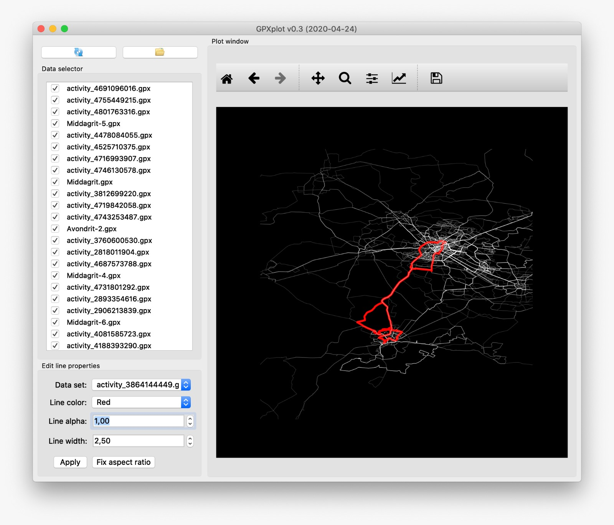

# GPXtools
This repository contains a cli tool and a GUI application to process GPX files generated by Garmin watches, Strava, etc. and to visualize them. 

### GPXplot
The GUI application `GPXplot.py` and `GPXplot_standalone.pyw` provide the user a graphical user interface to visualize their .gpx files. Furthermore, the GUI provides tools to edit properties of drawn lines, so that one can customize the plot. 

A screenshot of the tool is shown below:

**Installation**

There are two versions of the script: `GPXplot.py` which can be run from the Spyder IDE or `GPXplot_standalone.pyw` which can be run from the command prompt / terminal directly (1). Make sure to also download the `gpxparse.py` file along with the two `.png` icon files. Place all files in the same directory and run the script. 

**Usage**

When the GUI appears, one can do the following:
- Load .gpx files from a specific folder (click the 'Open folder' button)
- Toggle files on and off in the data selector. To update the plot, hit the 'Refresh' button next to the 'Open folder' button.
- Edit line properties for the selected line. 
- After interacting with the matplotlib tools (such as using the zoom functionality), the image's aspect ratio might be wrong. Click the 'Fix aspect ratio' button to restore the axes such that they are of equal size. 

Data can be saved from the app. A .png or .jpeg file will always have a 600x600px resolution. To obtain a higher resolution image, export the data as a vector image (.eps or .pdf) and convert it with appropriate tools into a high res image of the required size.

### GPXheatgen
The script `GPXheatgen.py` is a cli tool to generate a heatmap from GPX files directly. To use the script, place it in the same folder as the .gpx files and run the script. The script will generate black-on-white and white-on-black images and store them into the same folder. 

##### Acknowledgements
We wish to thank [steventebrinke](https://github.com/steventebrinke/) for his efforts in adding the pyproj code to correctly transform the data, taking the earth's curvature into account. 

(1): the Spyder IDE requires the application to be closed differently in order for the console to stop running the script. Since the fixes introduced for Spyder break the normal behavior in other apps (such as standalone usage), we provide two seperate versions.
